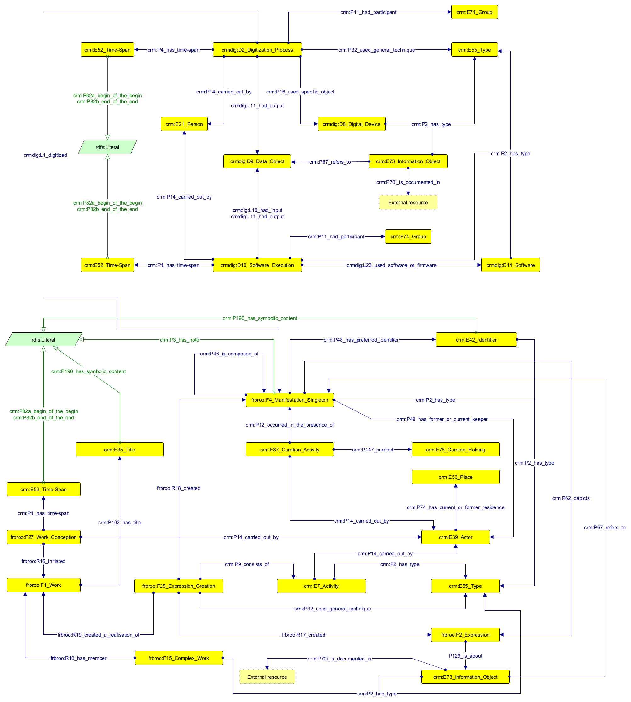

# CIDOC CRM Application Profile for Digitizing Exhibitions 

## Object level
An object or cultural resource that is part of Aldrovandi's exhibition is conceptualized according to FRBR: 
* `frbroo:F1_Work` (the essence of the object). It is initiated in a conception event (`frbroo:F27_Work_Conception`) within a certain period of time (`crm:E52_Time-Span`) characterized by a beginning and an end date. A Work is also characterized by a series of titles (`crm:E35_Title`); each title can be either a original title or a different title used for the exhibition (`crm:E55_Type`). Finally, a Work may also be part of a larger Work (`frbroo:F15_Complex_Work`), such as a series of printed volumes, which in turn belongs to a certain type (`crm:E55_Type`).
* `frbroo:F2_Expression` (the intellectual content of the object). It is created in a creation event (`frbroo:F28_Expression_Creation`). A creation event may consists of other smaller activities (`crm:E7_Activity`), each carried out by one or more agents (`crm:E39_Actor`) and characterized by a certain type that represents the agent's role (`crm:E55_Type`). In addition, a creation event is carried out by using a certain type of creation technique (`crm:E55_Type`). In general, a creation event functions as a pivot point that connects Work, Expression and Manifestation. Moreover, an Expression can be characterized with one or more subjects related to its contents (`crm:E73_Information_Object` with type `aat:300404126`).
* `frbroo:F4_Manifestation_Singleton` (the object itself). It is characterized by a series of descriptive components, such as descriptive labels, types (`crm:E55_Type`) and identifiers (`crm:E42_Identifier`). When applicable, it is also related to a curation activity (`crm:E87_Curation_Activity`) carried out by a keeper (`crm:E39_Actor`), who curates a collection (`crm:E78_Curated_Holding`) the object is part of, located in a certain place (`crm:E53_Place`). A Manifestation can be composed of other Manifestations and can also depict the Expression of another object that is somehow related to it (e.g. a video displaying a manuscript is a Manifestation that is depicting another object's Expression; a tablet displaying the picture of a speciment is a Manifestation that is depicting another object's Expression; and so on). Finally, a Manifestation is referred to by a copyright statement or license (`crm:E73_Information_Object` with type `aat:300435434`).

## Process level
A 3D digitization workflow is made up by two main types of activity:
* a **digitization process** (`crmdig:D2_Digitization_Process`);
* a series of **software executions** (`crmdig:D10_Software_Execution`).

A **digitization process** has the following characteristics:
* it involves the digitization of a real-world object (`frbroo:F4_Manifestation_Singleton`)
* it produces an output that is a digital model (`crmdig:D9_Data_Object`) of the original physical object;
* it takes place within a certain period of time (`crm:E52_Time-Span`), defined by a start date and a end date;
* it involves agents - such as people (`crm:E21_Person`), who participate in such activity, and intitutions (`crm:E74_Group`), which are responsible for it;
* it also involves using techniques (such as photogrammetry or structured light scanning) (`crm:E55_Type`) and tools (like structured light scanners - e.g. Scanner Spider) (`crmdig:D8_Digital_Device`).

A **software execution**  has the following characteristics:
* it has a type that reflects a certain stage or phase of digitization (`crm_E55_Type`) within the workflow (e.g. processing, modelling, optimization, etc.);
* it involves the treatment of a digital object (`crmdig:D9_Data_Object`) as an input ;
* it produces an output that is a digital model (`crmdig:D9_Data_Object`);
* it takes place within a certain period of time (`crm:E52_Time-Span`), defined by a start date and a end date;
* it involves agents - such as people (`crm:E21_Person`), who participate in such activity, and intitutions (`crm:E74_Group`), which are responsible for it;
* it also involves using tools (like 3D scanning software - e.g. Artec Studio 14) (`crmdig:D14_Software`).

## Complete model
