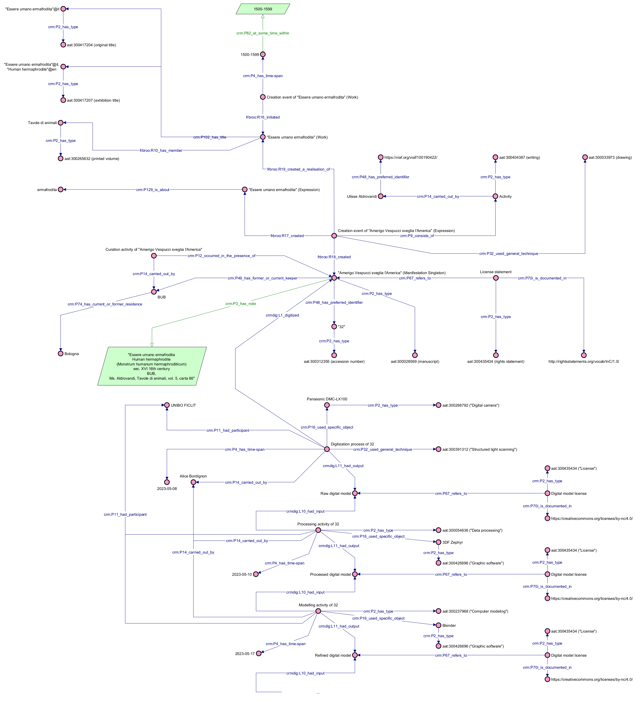

# Example 1: ALD-32 (*Essere umano ermafrodita*)

This object can be represented as follows:
* at the FRBR level of Work, the object has been initiated by a work conception within a time period that spans from 1500 to 1599. The work has also three titles ("Essere umano ermafrodita", "Essere umano ermafrodita", "Human hermaphrodite"). Finally, it is part of the print volume Tavole di animali.
* at the FRBR level of Expression, the object has been created in a creation event by using drawing as a technique. The event consists in an authorship activity carried out by Ulisse Aldrovandi. ermafrodita is related to the expression as a subject.
* at the FRBR level of Manifestation, the object has been involved in a curation activity carried out by BUB (located in Bologna). Moreover, the Manifestation is characterized by having three identifiers ("ALD-32" as the collection ID, "5" as the volume number and "Ms. Aldrovandi, Tavole di animali, vol. 5, carta 86"), a description, and a type (manuscript).

The process of digitization can be represented as follows:
* On 08/05/2023, Alice Bordignon acquired digital data of the object "ALD-32" ("Essere umano ermafrodita") on behalf of UNIBO FICLIT, leveraging photogrammetry and using the "Panasonic DMC-LX100" camera, resulting in a digital model.
* Subsequently, on 10/05/2023, Alice processed the digital model on behalf of UNIBO FICLIT using the "3DF Zephyr" software, creating a processed digital model.
* From 17/05/2023 to 18/05/2023, Alice further modeled the processed digital model ob behalf of UNIBO FICLIT using the "Blender" software, resulting in a refined digital model.
* On 18/05/2023 to 19/05/2023, Alice optimized the refined digital model on behalf of UNIBO FICLIT using the "InstantMeshes-3DF Zephyr" software, resulting in an optimized digital model.
* On 19/05/2023, Alice exported the optimized digital model on behalf of UNIBO FICLIT using the "Blender" software, resulting in the final exported model as an output.
* Finally, on 19/5/2023, Alice uploaded the exported model on behalf of UNIBO FICLIT using "Nextcloud" and "Aton" software, resulting in the published model as an output.

## File
Assertion component of the example: [link](Abox.ttl)