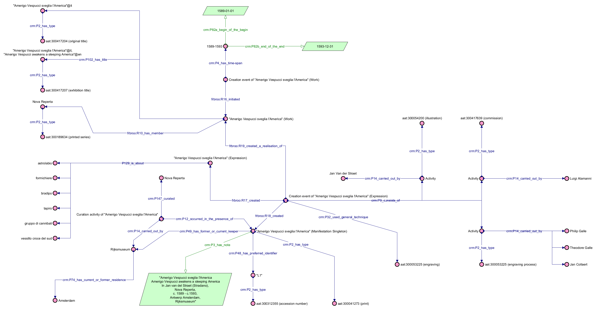

# Example 1: L1 (*Amerigo Vespucci sveglia l'America*)
This object can be represented as follows:
* at the FRBR level of Work, the object has been initiated by a work conception within a time period that spans from 1589 to 1593. The work has also three titles ("Amerigo Vespucci sveglia l'America", "Amerigo Vespucci sveglia l'America", "Amerigo Vespucci awakens a sleeping America"). Finally, it is part of the printed series Nova Reperta.
* at the FRBR level of Expression, the object has been created in a creation event by using engraving as a technique. The creation event is made up by three activities (illustration, carried out by Jan Van der Straet; engraving-process, carried out by Philip Galle, Theodore Galle and Jan Collaert; commission, carried out by Luigi Alamanni). A series of subjects are related to the expression itself: "astrolabio", "formichiere", "bradipo", "tapiro", "gruppo di cannibali" and "vessillo croce del sud".
* at the FRBR level of Manifestation, the object has been involved in a curation activity carried out by Rijksmuseum (located in Amsterdam) which curated the collection Nova Reperta. Moreover, the Manifestation is characterized by having an identifier ("L1"), a description, and a type (print).

## File
Assertion component of the example: [link](Abox.ttl)
