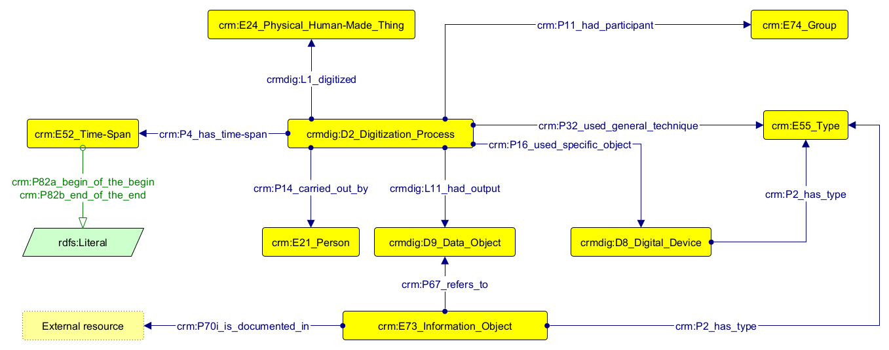

# Digitization process of Aldrovandi's exhibition

## Description
A 3D digitization workflow is made up by two main types of activity:
* a **digitization process** (`crmdig:D2_Digitization_Process`);
* a series of **software executions** (`crmdig:D10_Software_Execution`).

A **digitization process** has the following characteristics:
* it involves the digitization of a real-world object (`crm:E24_Physical_Human-Made_Thing`)
* it produces an output that is a digital model (`crmdig:D9_Data_Object`) of the original physical object;
* it takes place within a certain period of time (`crm:E52_Time-Span`), defined by a start date and a end date;
* it involves agents - such as people (`crm:E21_Person`), who participate in such activity, and intitutions (`crm:E74_Group`), which are responsible for it;
* it also involves using techniques (such as photogrammetry or structured light scanning) (`crm:E55_Type`) and tools (like structured light scanners - e.g. Scanner Spider) (`crmdig:D8_Digital_Device`).

A **software execution**  has the following characteristics:
* it has a type that reflects a certain stage or phase of digitization (`crm_E55_Type`) within the workflow (e.g. processing, modelling, optimization, etc.);
* it involves the treatment of a digital object (`crmdig:D9_Data_Object`) as an input ;
* it produces an output that is a digital model (`crmdig:D9_Data_Object`);
* it takes place within a certain period of time (`crm:E52_Time-Span`), defined by a start date and a end date;
* it involves agents - such as people (`crm:E21_Person`), who participate in such activity, and intitutions (`crm:E74_Group`), which are responsible for it;
* it also involves using tools (like 3D scanning software - e.g. Artec Studio 14) (`crmdig:D14_Software`).

## Complete model
