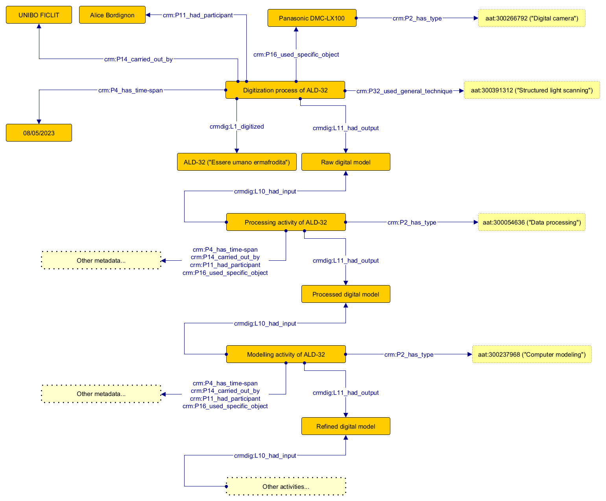

# Example 1: 32 (*Essere umano ermafrodita*)

On 08/05/2023, Alice Bordignon acquired digital data of the object "32" ("Essere umano ermafrodita") on behalf of UNIBO FICLIT, leveraging photogrammetry and using the "Panasonic DMC-LX100" camera, resulting in a digital model.

Subsequently, on 10/05/2023, Alice processed the digital model on behalf of UNIBO FICLIT using the "3DF Zephyr" software, creating a processed digital model.

From 17/05/2023 to 18/05/2023, Alice further modeled the processed digital model ob behalf of UNIBO FICLIT using the "Blender" software, resulting in a refined digital model.

On 18/05/2023 to 19/05/2023, Alice optimized the refined digital model on behalf of UNIBO FICLIT using the "InstantMeshes-3DF Zephyr" software, resulting in an optimized digital model.

Finally, on 19/05/2023, Alice exported the optimized digital model on behalf of UNIBO FICLIT using the "Blender" software, resulting in the final exported model as an output.

## File
Assertion component of the example: [link](Abox.ttl)

## Diagram
